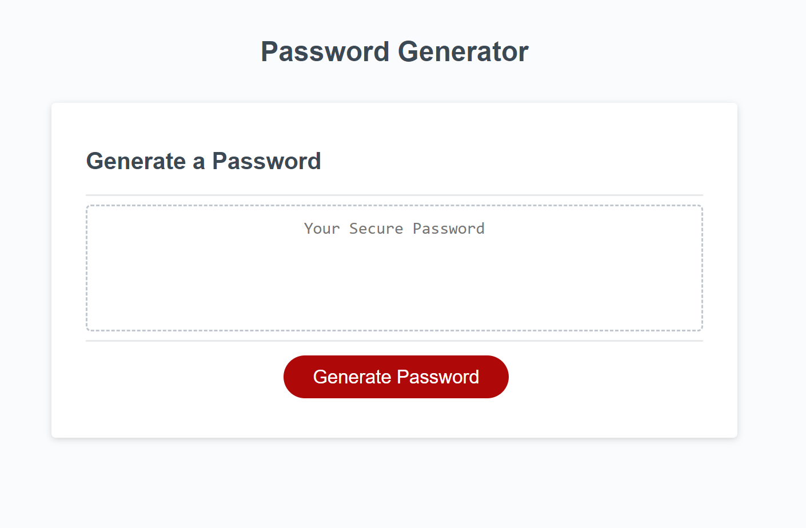

# 03 JavaScript: Password Generator

## Purpose: 
  1. Web document should prompt user with options for password characters and generate a random password based on the choices.
  2. generator will not accept invalid password lengths

## Challenges:
  1. JS syntax and taking a big problem and separating it into smaller chunks.
  2. Knowing what syntax should go inside the main function

## Images:
  
  
## Github Page
  [Github page](https://bosalinas.github.io/random-password-generator/)
